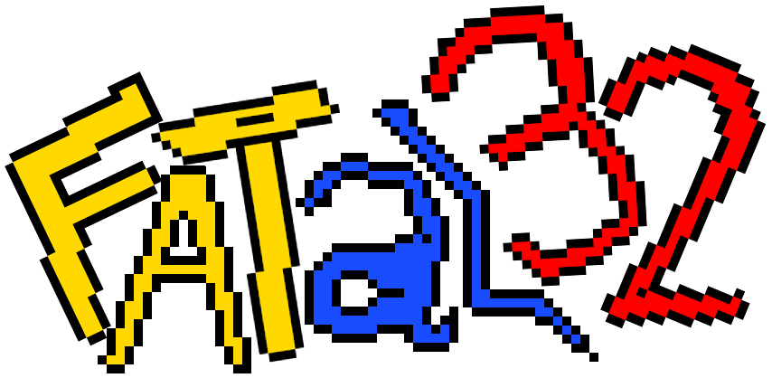
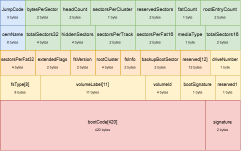
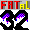

<p align="center">
  
</p>

# **FATal32** 

FATal32 é um sistema interativo em C/C++ para manipulação de imagens FAT32. Ele simula um shell customizado que permite gerenciar arquivos e diretórios diretamente em uma imagem FAT32, oferecendo suporte a comandos similares aos encontrados em sistemas Unix/Linux, como `ls`, `cd`, `cp`, `mv`, `rm`, entre outros.  

## **1. Estruturas da FAT32**  
O FAT32 (File Allocation Table 32) é um sistema de arquivos amplamente utilizado, caracterizado por uma estrutura organizada em três áreas principais:  

<p align="center">
  
</p>

- **Setor de Boot:** Contém metadados essenciais, como tamanho do cluster, número de setores por FAT e cluster raiz.  
- **Tabela de Alocação de Arquivos (FAT):** Gerencia a alocação dos clusters e mantém a relação entre arquivos e suas localizações.  
- **Área de Dados:** Contém os arquivos e diretórios armazenados no sistema FAT32.  

### **Estruturas principais utilizadas no projeto**  

1. **Boot Sector** (Setor de Boot)  
   Estrutura responsável por armazenar informações básicas do sistema de arquivos, como tamanho do setor e número de clusters disponíveis.  

2. **Directory Entry** (Entrada de Diretório)  
   Estrutura utilizada para armazenar informações de arquivos e diretórios, incluindo nome, tamanho, data de criação e atributos.  

3. **LFN Entry** (Long File Name Entry)  
   Permite armazenar nomes de arquivos longos no FAT32, estendendo o formato tradicional do **8.3 (nome.ext)**.  

Essas estruturas são essenciais para navegar corretamente pelo sistema de arquivos e realizar operações como leitura, escrita e manipulação de diretórios.  

## **2. Funcionalidades**  
- 📂 **Informações do disco:** Exibe detalhes sobre o sistema FAT32, incluindo o setor de boot.  
- 📌 **Manipulação de diretórios e arquivos:** Permite criar, remover, copiar, mover e renomear arquivos e diretórios.  
- 📖 **Navegação:** Suporte aos comandos `ls` e `cd` para listar diretórios e alterar o diretório atual.  
- 🛠️ **Interação intuitiva:** Os comandos foram projetados para serem semelhantes aos utilizados em sistemas Unix/Linux.  

## **3. Requisitos**  
- **Sistema Operacional:** Linux.  
- **Compilador:** GCC ou similar.  

## **4. Como Executar**  

## Como Executar
1. Construa o projeto utilizando o Makefile:
```bash
make
```
2. Execute o programa:
```bash
./fatal32 caminho/absoluto/da/sua/imagem.img
```
## **5. Comandos Disponíveis**  

Lista de comandos do FATal32 para manipulação de arquivos e diretórios.  

| Comando                | Descrição                                                   | Exemplo                        |
|------------------------|-----------------------------------------------------------|--------------------------------|
| `info`                | Exibe informações do disco e da FAT.                      | `info`                         |
| `cluster <num>`       | Exibe o conteúdo do bloco `<num>` em texto.               | `cluster 5`                    |
| `pwd`                 | Exibe o diretório corrente (caminho absoluto).            | `pwd`                          |
| `cd <path>`           | Altera o diretório corrente para `<path>`.                | `cd pasta1`                    |
| `touch <file>`        | Cria o arquivo `<file>` vazio.                            | `touch notas.txt`              |
| `mkdir <dir>`         | Cria o diretório `<dir>` vazio.                           | `mkdir projetos`               |
| `rm <file>`           | Remove o arquivo `<file>`.                               | `rm relatorio.pdf`             |
| `rmdir <dir>`         | Remove o diretório `<dir>` se estiver vazio.             | `rmdir documentos`             |
| `rename <file> <new>` | Renomeia `<file>` para `<new>`.                          | `rename antigo.txt novo.txt`   |
| `ls`                  | Lista arquivos e diretórios do diretório corrente.       | `ls`                           |
| `help`                | Abre a Help Sheet.                                       | `help`                         |
| `extra`               | Abre a Extra Sheet.                                      | `extra`                        |
| `exit`                | Sai do programa.                                         | `exit`                         |


## **6. Estrutura do Projeto** 
```
FATal32/
│── src/
│   ├── fat32/           # Implementação das funções FAT32
│   ├── shell/           # Implementação do shell interativo
│   ├── utils/           # Funções auxiliares
│── imgs/                # Imagens de referência
│── myimagefat32.img     # Imagem FAT32 de exemplo
│── Makefile             # Script de compilação
│── README.md            # Documentação do projeto
│── fatal32              # Executável gerado após a compilação
```

## **7. Exemplificação**  
Na pasta raiz do projeto há um arquivo `myimagefat32.img`. Caso deseje testar, utilize este arquivo passando seu caminho absoluto como argumento ao executar o programa.  

```bash
./fatal32 /caminho/absoluto/myimagefat32.img
```

<p align="right">  </p>

